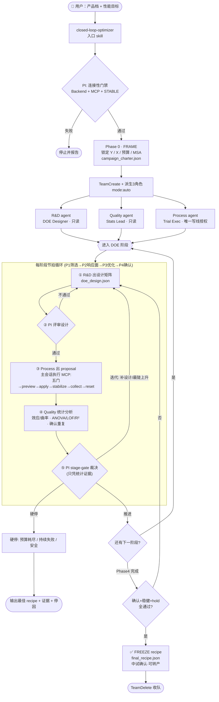

# 中试线 DOE 优化流程（端到端）

> 本文件描述当前 `Online_optimizer` 项目「薄膜双拉中试线 DOE 配方研发」的完整运行流程。
> 配套：方法学见 `.claude/skills/closed-loop-optimizer/references/doe-campaign-framework.md`；各角色方法见 `quality-engineer` / `rd-engineer` / `process-engineer` skill。

---

## 1. 一句话概括

用户给出**产品档 + 性能目标** → 触发 `closed-loop-optimizer` 入口 skill → **PI 编排器**验证连通性、写 Phase-0 章程、`TeamCreate` 派生三位专家 agent（auto 权限）→ 团队按 **4 阶段顺序 DOE**（筛选→响应面→优化→确认）在数字中试线上系统化试验，每个阶段由 PI 凭**统计证据**做 stage-gate 裁决 → 产出满足所有性能目标、经确认与稳健性验证的 **可转产 recipe** → 冻结、收队。

---

## 2. 流程图（ASCII · 终端可读）

```
┌──────────────────────────────────────────────────────────────────┐
│  用户：产品档 + 性能目标                                           │
│  "为 PMMA 开发高透光、低双折射波动的 recipe"                       │
└────────────────────────────┬─────────────────────────────────────┘
                             ▼
                ┌─────────────────────────┐
                │ closed-loop-optimizer   │  ← 唯一入口 skill
                │ (触发词: recipe研发/    │
                │  DOE/产线优化/中试线)   │
                └────────────┬────────────┘
                             ▼
        ╔═══════════════════════════════════════════╗
        ║  PI 编排器 (closed-loop-optimization-     ║
        ║  orchestrator, opus)                      ║
        ╠═══════════════════════════════════════════╣
        ║  Step1 连接性门禁                          ║
        ║   Backend(:4317)✓ MCP工具✓ 产线STABLE✓    ║
        ║   任一失败 → 停止并报告                    ║
        ╚════════════════════╤══════════════════════╝
                             ▼
        ┌────────────────────────────────────────────┐
        │  Phase 0 — FRAME                           │
        │  锁定 Y(响应)+X(因子范围)+预算+MSA          │
        │  → 00_frame/campaign_charter.json          │
        └────────────────────┬───────────────────────┘
                             ▼
          TeamCreate + 派生 3 角色 (mode:"auto")
          ┌────────────────┼────────────────┐
          ▼                ▼                ▼
   ┌─────────────┐  ┌─────────────┐  ┌─────────────┐
   │  R&D agent  │  │ Quality agent│  │ Process agent│
   │ DOE Designer│  │ Stats Lead  │  │ Trial Exec   │
   │  (只读/设计) │  │ (只读/统计)  │  │(唯一写线授权)│
   │→rd-engineer │  │→quality-    │  │→process-     │
   │   skill     │  │ engineer sk │  │ engineer sk  │
   └──────┬──────┘  └──────┬──────┘  └──────┬──────┘
          └────────────────┼────────────────┘
                           ▼
   ╔═══════════════════════════════════════════════════════════╗
   ║   4 阶段顺序 DOE — 每阶段执行同一节拍循环                    ║
   ║   Phase1 筛选 → Phase2 响应面 → Phase3 优化 → Phase4 确认    ║
   ╠═══════════════════════════════════════════════════════════╣
   ║                                                           ║
   ║   ┌────────────────────────────────────────────────┐      ║
   ║   │ ① R&D 出本阶段设计矩阵                          │      ║
   ║   │   筛选:部分析因+中心点  RSM:CCD/BB  优化:期望函数 ║      ║
   ║   │   → doe_design_<phase>_<n>.json                │      ║
   ║   └───────────────────┬────────────────────────────┘      ║
   ║                       ▼                                    ║
   ║   ┌────────────────────────────────────────────────┐      ║
   ║   │ ② PI 评审设计                                   │      ║
   ║   │   被上阶段分析支撑? 含中心点? 随机化? 在安全包络? │      ║
   ║   └───────────────────┬────────────────────────────┘      ║
   ║              不通过 ───┤←──── R&D 改                       ║
   ║                       ▼ 通过                              ║
   ║   ┌────────────────────────────────────────────────┐      ║
   ║   │ ③ Process 逐 run 产出 proposal                  │      ║
   ║   │   主会话执行 MCP（subagent 无 MCP）:             │      ║
   ║   │   五门 → preview → apply → run_until_stable     │      ║
   ║   │   → collect(仅稳态测) → reset 基线(run间复位)    │      ║
   ║   │   → trial_<run>/run_log.json + 偏离标记          │      ║
   ║   └───────────────────┬────────────────────────────┘      ║
   ║                       ▼                                    ║
   ║   ┌────────────────────────────────────────────────┐      ║
   ║   │ ④ Quality 统计分析这批 run                      │      ║
   ║   │   筛选:效应估计/Lenth/曲率检验  RSM:ANOVA/LOF/   │      ║
   ║   │   R²族/残差  确认:重复均值vs目标vs预测区间        │      ║
   ║   │   → doe_analysis_<phase>_<n>.json + 置信度       │      ║
   ║   └───────────────────┬────────────────────────────┘      ║
   ║                       ▼                                    ║
   ║   ┌────────────────────────────────────────────────┐      ║
   ║   │ ⑤ PI stage-gate 裁决（只凭统计证据）             │      ║
   ║   └───────────────────┬────────────────────────────┘      ║
   ║                       │                                    ║
   ║        ┌──────────────┼──────────────┐                     ║
   ║        ▼              ▼              ▼                     ║
   ║    推进下一阶段   迭代(补设计/      硬停                    ║
   ║                   最陡上升移区)    (预算/持续失败/安全)      ║
   ║        │              │              │                     ║
   ║        │  ←───────────┘              │                     ║
   ╚════════│════════════════════════════│═════════════════════╝
            ▼                            ▼
   ┌────────────────────────┐   ┌─────────────────────────────┐
   │ Phase 4 全通过         │   │ 硬停 → 输出最佳观测 recipe   │
   │ 确认重复在目标+预测区间  │   │      + 证据链 + 停因 + 建议  │
   │ 稳健性扰动在规格内       │   └─────────────────────────────┘
   │ hold-window 满足        │
   └───────────┬────────────┘
               ▼
   ┌────────────────────────────────┐
   │ ✅ FREEZE recipe               │
   │   outputs/final_recipe.json    │
   │   标记"中试确认，可转产"        │
   └───────────┬────────────────────┘
               ▼
        TeamDelete 收队
```

---

## 3. 流程图（Mermaid · 可渲染为专业图形）

将下面代码贴入 [mermaid.live](https://mermaid.live) 或任何支持 mermaid 的 markdown 查看器即可渲染：



---

## 4. Stage-Gate 判据（PI 推进阶段的硬规则）

| Gate | 通过条件（必须统计证据） | 不通过则 |
|------|------------------------|---------|
| 0 → 1 | Y/X/预算锁定，MSA 可信 | 重新框定 |
| 1 → 2 | 筛出 active 因子 + 中心点显示曲率 | 重设范围 / 重框定 |
| 2 → 3 | 无失拟 LOF、R²/pred-R² 可接受、残差干净 | 扩充设计 / 减项 |
| 3 → 4 | 预测最优点落在所有 Y 窗口内 | 最陡上升移区 → 回 Phase 2 |
| 4 → FREEZE | 确认重复在目标+预测区间、稳健扰动在规格、hold-window 满足 | 回 Phase 2/3 诊断 |

---

## 5. 三角色在每阶段节拍中的职责

| 节拍步 | R&D（DOE Designer） | Quality（Stats Lead） | Process（Trial Exec） | PI（编排器） |
|--------|--------------------|----------------------|----------------------|-------------|
| ① 设计 | **出设计矩阵** | — | — | — |
| ② 评审 | 据反馈改设计 | — | — | **评审放行** |
| ③ 执行 | — | — | **出 proposal，主会话跑 run** | — |
| ④ 分析 | — | **统计分析，出裁决** | — | — |
| ⑤ gate | 出下一阶段设计 | 提供统计证据 | 执行下一批 run | **stage-gate 裁决** |

---

## 6. 权限与执行模型（关键）

- 所有 agent 在 **auto 权限模式**下运行（`settings.json` 全局 `defaultMode: auto` + 派生时 `mode: "auto"`）。
- agent 工具已精简到**基本内置工具**（Read/Write/Glob/Grep/TodoWrite/SendMessage；PI 额外有 Agent/TeamCreate/TeamDelete）。
- **MCP 不注入 subagent**——所以产线写入的执行链是：Process 产出**通过五门的 proposal 工件** → **主会话**据此调用 MCP（preview→apply→run_until_stable→collect）→ 回执写回工区供 Process/Quality 复核。
- 权限边界（**只有 Process 能授权写线**）以"授权"形式保留，而非 subagent 工具白名单。
